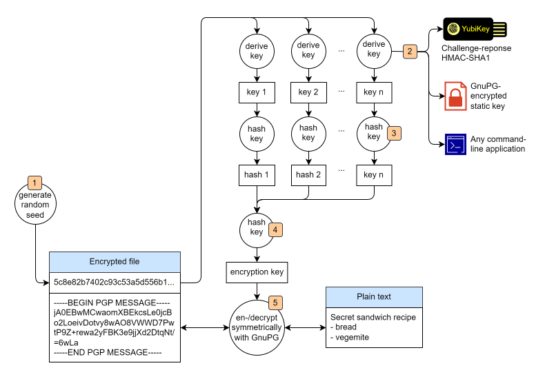
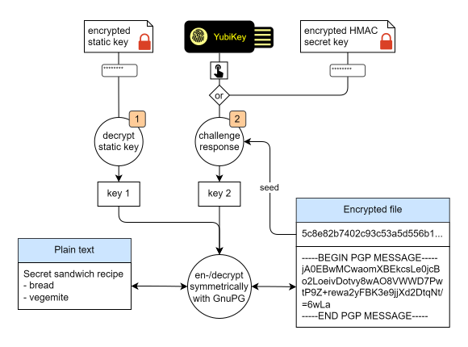

# gpg2f

`gpg2f` is a wrapper for the GNU Privacy Guard. It strengthens symmetric encryption with second factors like YubiKey challenge-response. `gp2f` integrates with [QtPass](https://qtpass.org) and [Browserpass](https://github.com/browserpass/browserpass-extension) (password store). It can be extended with any custom second factor that has a command-line interface.

- [Overview](#overview)
- [Prerequisites](#prerequisites)
- [Installation](#installation)
- [Configuration](#configuration)
- [Usage](#usage)
- [Directory structure](#directory-structure)
- [Password store](#password-store)
- [Why not use asymmetric encryption?](#why-not-use-asymmetric-encryption)

## Overview

`gpg2f` uses the [GNU Privacy Guard](https://gnupg.org) to perform symmetric encryption. It generates a random seed and uses a configurable set of mechanisms to derive the encryption key. Second factors might include [YubiKey](https://www.yubico.com) challenge-response or any other key derivation method with a command-line interface.



1. Whenever content is encrypted, `gpg2f` generates a random seed with OpenSSL. The seed is stored as unencrypted plain text alongside the encrypted payload. It is used to derive the encryption key.
2. Each configured factor produces a key. This is done through shell scripts or command-line applications. They can either derive the key from the seed or produce a static key.
   - A YubiKey can be used to derive an HMAC-SHA1 key from the seed. It can be configured to require a touch for every challenge-response operation.
   - A key can also be static and extracted from an encrypted file (without incorporating the seed). This requires a passphrase, complementing YubiKey's challenge-response (which can't be PIN-protected).
   - `gpg2f` can use any command-line application capable of consuming a seed from `stdin` (if needed) and printing the derived (or static) key to `stdout`. For example, a script could send the seed as a challenge to a server that returns the response only to clients in whitelisted IP address ranges (like a company VPN).
3. Each derived key is hashed (for example via `SHA-256` or `SHA-512`).
4. The hashes of all derived keys are concatenated and the result is hashed again. This forms the final encryption key.
5. The encryption key is used as a passphrase to symmetrically en- and decrypt content with the GNU Privacy Guard.

Generating a random seed before encrypting content adds an extra layer of security (on top of the second factor). It causes each file to have a different encryption key. The seed (and the key) changes whenever a file is re-encrypted (no matter if modified or not). Observing the en- or decryption of a file does not allow an attacker to also decrypt other files.

## Prerequisites

`gpg2f` is a set of shell scripts for UNIX. It has been developed and tested with [Cygwin](https://cygwin.com) on Windows. It requires `bash` and common UNIX command line tools (like `cat` and `head`), as well as `xxd` and the GNU Privacy Guard. To use a YubiKey, `ykman` (part of the [YubiKey Manager](https://www.yubico.com/support/download/yubikey-manager/)) needs to be installed as well.

## Installation

`gpg2f` can be downloaded from <https://github.com/david-04/gpg2f/releases> or cloned as a repository:

```shell
git clone --depth 1 https://github.com/david-04/gpg2f.git
```

Upgrading to a newer release involves either downloading and extracting it over the previous installation or running `git pull` in the cloned repository. After extracting/cloning/updating the application, make the following scripts executable:

```shell
chmod +x decrypt.sh encrypt.sh `find .gpg2f -name '*.sh'`
```

To verify that all required programs are installed and working, run the command below. When prompted for a password, enter `x` (a single lowercase letter).

```shell
echo "Hello world!" | ./encrypt.sh
```

The command might abort with an error like this:

```
gpg2: command not found
```

By default, `gpg2f` uses the command `gpg2` to run the GNU Privacy Guard. If it's installed under a different name (e.g. `gpg`), open the `settings.sh` and update the `GPG2F_GPG_CMD` variable on top of the file. Then try to encrypt again:

```shell
echo "Hello world!" | ./encrypt.sh
```

If everything works, the encrypted content is printed to the terminal:

```
54b54223babb3ec30312d77de8dec14ccf63dd46771543fe28f87ec08ee5b51205b6ca73e5ba3364c347d91ab2feafe0295755b4e7e2c6847c9c66a8049cff
-----BEGIN PGP MESSAGE-----

jA0ECQMCTypbRYFLLdHj0kIBLQgqhhlDVXkonzQHFEUIIe4drW2rRzs9FETyoT9t
EsLm++P9gVghMSghGXDLsC7DI4M7fqjF5Y1wPdlLSTHaov0=
=dONU
-----END PGP MESSAGE-----
```

Now verify, that encrypted content can also be decrypted again:

```shell
echo "Hello world!" | ./encrypt.sh | ./decrypt.sh
```

This should print the original message `Helow world!`

## Configuration

This section shows how to set up the following two-factor configuration:



1. A random string is stored as a static key in an encrypted file. Whenever `gpg2f` en- or decrypts content, it loads the static key from this file. This requires the passphrase to be entered. The passphrase is cached by the GNU Privacy Guard Agent and doesn't need to be entered every single time. The caching duration can be configured.
2. The second factor is an HMAC-SHA1 challenge-response. The secret is stored on a YubiKey and the response is calculated there as well. Whenever `gpg2f` en- or decrypts content, the YubiKey must be touched. As a fallback, the HMAC secret is also stored in an encrypted file. From there, it can be copied to a spare YubiKey (to be used as a backup). The encrypted secret can also be used to calculate the HMAC response locally. This requires the passphrase to be entered. Calculating the HMA response without a YubiKey should be avoided whenever possible. It provides opportunities for attackers to obtain the secret key.

The first step is to set up the static key. Start by creating a directory where all keys and secrets are stored:

```shell
mkdir .keys
```

A random static key can be generated with OpenSSL. Verify that it produces a random string:

```shell
.gpg2f/scripts/generate-seed/openssl-hex.sh 100
```

This should print a very long random string like this:

```
33f2082b392f4ff1bc3f6be2884199119a1eeb258ddc15fe6b30b2d00fba8bcfcf6502bbc264a04e338d298294805abe5cabe26db7905fca4460bbaf52f8918c9b22e5bcae4eb918380e89986f25a1363fc2c70ad1f729d9da6314617de9b9c44b9b6eef
```

Now generate a random key, encrypt it with the GNU Privacy Guard and store it in `.keys/static-key.gpg`. This will prompt for a passphrase. Although the GNU Privacy Guard Agent caches the passphrase for a while, it will still need to be entered quite frequently.

```shell
.gpg2f/scripts/generate-seed/openssl-hex.sh 100 | gpg2 --quiet --no-permission-warning --armor --symmetric --cipher-algo AES256 --s2k-digest-algo SHA512 --output .keys/static-key.gpg
```

The next step is to generate an HMAC challenge-response secret key. The approach is the same as for the static key: Generate a random string with OpenSSL, encrypt it with the GNU Privacy Guard, and save it in `.keys/hmac-secret-key.gpg`. Please note that there are only rare occasions when this file needs to be decrypted and the passphrase has to be entered. It might be needed only after a long time, when the YubiKey is lost or stops working. Make sure that you can still remember or recover the passphrase.

```shell
.gpg2f/scripts/generate-seed/openssl-hex.sh 20 | gpg2 --quiet --no-permission-warning --armor --symmetric --cipher-algo AES256 --s2k-digest-algo SHA512 --output .keys/hmac-secret-key.gpg
```

Now the secret key can be copied to the YubiKey. The command below uses the `ykman` command-line utility (part of the YubiKey Manager). It configures slot 1 for challenge-response. Change the parameter at the end of the command from `1` to `2` to configure slot 2 instead. Please note that this command will overwrite the slot's current configuration without additional prompt.

```shell
( gpg2 --quiet --no-permission-warning --output - --decrypt .keys/hmac-secret-key.gpg && echo y ) | ykman otp chalresp --touch 1
```

Alternatively, decrypt the secret key and copy-and-paste it into the YubiKey Manager frontend:

```shell
gpg2 --quiet --no-permission-warning --output - --decrypt .keys/hmac-secret-key.gpg
```

The next step is to configure `gpg2f` to use the YubiKey and the encrypted key files. Open `settings.sh` and locate the `Key derivation` section and set the command variables as follows (change the parameter `1` in the last line to `2` if you have configured the HMAC secret key on YubiKey's slot 2):

```shell
export GPG2F_DERIVE_DECRYPTION_KEY_CMD=(
    ".gpg2f/scripts/gpg/decrypt-file-to-stdout.sh .keys/static-key.gpg"
    ". .gpg2f/scripts/derive-key/openssl-hmac-sha1.sh .keys/hmac-secret-key.gpg"
)
export GPG2F_DERIVE_ENCRYPTION_KEY_CMD=(
    ".gpg2f/scripts/gpg/decrypt-file-to-stdout.sh .keys/static-key.gpg"
    "with-notification 'Touch the YubiKey' . .gpg2f/scripts/derive-key/yubikey-challenge-response.sh 1"
)
```

When encrypting (second variable), `gpg2f` will decrypt the static key and perform a challenge-response through the YubiKey. When decrypting (first variable), `gpg2f` won't use the YubiKey but instead decrypt the HMAC secret key from the file and calculate the response locally.

Try to encrypt a message. This might prompt for the passphrase of `.keys/static-key.gpg` (unless it's already cached) and should then require a touch of the YubiKey:

```shell
echo "Hello world!" | ./encrypt.sh test.gpg
```

Verify that the content was encrypted correctly:

```shell
cat test.gpg
```

The output should look similar to this:

```
6495f38fe36e495a4a4404b9be098ccc4e785e6c9ef7ae7c4f1f2c2338995971039adf896d0ab8d0b9fd4bef049bbaa3ea41307dd5c65a4c63d4808571efab
-----BEGIN PGP MESSAGE-----

jA0ECQMCJExXtYhgJZjq0kIBJVxow0Cr8oXMWtSPoW8dPT7sQyCLq8JoQALOM3io
jwkp+RaJEno6EQ9QVMAsTnG9frSVQn/YijjjHGsi4dGr13M=
=6tFz
-----END PGP MESSAGE-----
```

Unplug the YubiKey and verify that the locally stored backup of the HMAC secret key can be used to decrypt the file. This might again prompt for the passphrases of  `.keys/static-key.gpg` and `.keys/hmac-secret-key.gpg`.

```shell
./decrypt.sh test.gpg
```

This command should should produce the original `Hello world!` message.

Now that everything is working, go back to `settings.sh` and change the key derivation commands to use the YubiKey for both encryption and decryption (change parameter value `1` to `2` if you have configured the HMAC secret key on YubiKey's slot 2):

```shell
export GPG2F_DERIVE_DECRYPTION_KEY_CMD=(
    ".gpg2f/scripts/gpg/decrypt-file-to-stdout.sh .keys/static-key.gpg"
    "with-notification 'Touch the YubiKey' . .gpg2f/scripts/derive-key/yubikey-challenge-response.sh 1"
)
export GPG2F_DERIVE_ENCRYPTION_KEY_CMD=("${GPG2F_DERIVE_DECRYPTION_KEY_CMD[@]}")
```

Verify that it works by en- and decrypting a message:

```shell
echo "Hello world!" | ./encrypt.sh | ./decrypt.sh
```

This might prompt for the passphrase of `.keys/static-key.gpg`. Both operations should also require a touch of the YubiKey. That is, the YubiKey needs to be touched twice to complete the full cycle.

There are additional configuration parameters in `settings.sh`. They can be used to customize how the GNU Privacy Guard is invoked, how keys are hashed, and how pop-up notifications are displayed. Please refer to the comments in [.gpg2f/templates/config/settings.example.sh](https://github.com/david-04/gpg2f/blob/main/.gpg2f/templates/config/settings.example.sh) for more details.

Another tweak is to customize how long the GNU Privacy Guard Agent caches passphrases. The default depends on the  version of the GNU Privacy Guard. It might be something like 10 minutes. To reduce how often passphrases have to be re-entered, consider extending the default duration. Edit (or create) `~/.gnupg/gpg-agent.conf` and set the following parameters:

```shell
# When using GNU Privacy Guard version 2.1 or above
default-cache-ttl 86400
max-cache-ttl 86400

# When using GNU Privacy Guard version 2.0 or below
default-cache-ttl 86400
maximum-cache-ttl 86400
```

The duration is configured in seconds. For example, set it to `600` to cache passphrases for 10 minutes, or `86400` to cache them for 24 hours.

## Usage

Use `encrypt.sh` (or `encrypt.bat` on Windows) to encrypt content. The plain text is always read from `stdin`. The encrypted content can be written to either `stdout` or a file:

```shell
# Encrypt stdin to stdout
echo "Hello world!" | ./encrypt.sh

# Encrypt stdin to a file
echo "Hello world!" | ./encrypt.sh my-file.gpg
```

Use `decrypt.sh` (or `decrypt.bat` on Windows) to decrypt content. The encrypted content can be read from `stdin` or a file and the plain text is always written to `stdout`:

```shell
# Decrypt a file to stdou
./decrypt.sh my-file.gpg

# Decrypt stdin to stdou
cat ./my-file.gpg | ./decrypt.sh
```

Both commands need to be run from the application's root directory. They can't be invoked from a different directory.

The commands can also be called with the `--debug` option. This causes `gpg2f` to print diagnostic information for trouble-shooting:

```shell
echo "Hello world!" | ./encrypt.sh --debug | ./decrypt.sh --debug
```

Please note that this will not only display derived keys (that are specific to the seed) but also the decrypted static key. It is recommended to create and use temporary keys when trouble-shooting configuration issues.

## Directory structure

`gpg2f` contains the following files and directories:

```
gpg2f
+-- .gpg2f
|   +-- docs       <= documentation
|   +-- scripts    <= gpg2f implemenation (shell scripts)
|   +-- templates  <= templates and example files
|
+-- [...]          <= custom directories for encrypted files
|
+-- decrypt.bat    <= commands to encrypt or decrypt
+-- decrypt.sh
+-- encrypt.bat
+-- encrypt.sh
|
+-- settings.sh    <= configure keys and factors to use

```

Encrypted files should be stored inside the application directory. Create subdirectories as needed (e.g. one for a password store, another one for secure notes, ...).

## Password store

A password store a file/directory structure used by the password manager [pass](https://www.passwordstore.org). It contains a separate encrypted file for each account/website. The files can contain the username, password, and other relevant information. These files can be created and viewed through the `pass` command-line tool. They can also be managed through the [QtPass](https://qtpass.org) front end, or the  [Browserpass](https://github.com/browserpass/browserpass-extension) web browser extension. `gpg2f` does not integrate with `pass` itself. But it contains an adapter for QtPass and Browserpass. To set up a password store, create a directory:

```shell
mkdir password-store
```

Then copy the `.gpg-id` template file into it:

```shell
cp .gpg2f/templates/password-store/.gpg-id password-store
```

Verify that it was copied successfully:

```shell
cat  password-store/.gpg-id
```

This should produce the following output:

```
WEUSESYMMETRICENCRYPTIONANDDONOTNEEDAKEY
```

To use the password store with QtPass or Browserpass, they need to be configured to use the `gpg2f` shim (instead of directly calling `gpg`). There are two versions of the shim:

- UNIX: `.gpg2f/scripts/pass-gpg-shim.sh`

- Windows: `.gpg2f\scripts\pass-gpg-shim.bat`

When configuring QtPass or Browserpass, the full/absolute path needs to be used, for example:

- UNIX: `/home/david/gpg2f/.gpg2f/scripts/pass-gpg-shim.sh`

- Windows: `C:\gpg2f\.gpg2f\scripts\pass-gpg-shim.bat`

To use QtPass with the newly created password store (and `gpg2f`), open QtPass' configuration dialog. In the `Programs` tab, make sure that `Native Git/GPG` is selected. Enter the path to the shim in the the `GPG` field. In the `Profiles` tab, add a profile or set the `Current path` at the bottom to the password store directory created above (e.g. `C:\gpg2f\password-store`).

To use the password store with Browserpass, start by configuring the shim. This can be done directly in the web browser by opening the extension options and setting the `Custom gpg binary` property. Alternatively, copy the `.browserpass.json` template file into the password store directory:

```shell
cp .gpg2f/templates/password-store/.browserpass.json password-store
```

Then edit `password-store/.browserpass.json` and update the `gpgPath`. Backslashes (in Windows paths) need to be escaped. The path should look like

-  `C:\\gpg2f\\.gpg2f\\scripts\\pass-gpg-shim.bat` instead of
- `C:\gpg2f\.gpg2f\scripts\pass-gpg-shim.bat`).

To configure the password store directory (from where to load the credentials), open the Browserpass extension settings in the browser and add the password store directory under `Custom store locations`.

## Why not use asymmetric encryption?

Protecting secrets with security keys is much simpler when using asymmetric encryption with public and private keys. Many security keys support OpenPGP, which can be accessed through the GNU Privacy Guard. The latter is also used by `pass` and its ecosystem, including QtPass and Browserpass.

For the time being, this approach is perfectly secure. However, quantum computers are expected to break today's asymmetric encryption algorithms in the not-so-distant future. If an attacker gets hold of an asymmetrically encrypted password store today, they're likely able to crack it in a few years.

Research is underway to develop asymmetric encryption algorithms that can withstand quantum computer attacks. But they might still be based on the assumption that certain mathematical challenges can't be solved (in reasonable time). New mathematical discoveries could invalidate these assumptions.

Symmetric encryption tends to rely less on assumptions of certain mathematical challenges being too hard to solve. This might give them a somewhat better (albeit probably not perfect) chance to withstand attacks for longer.
